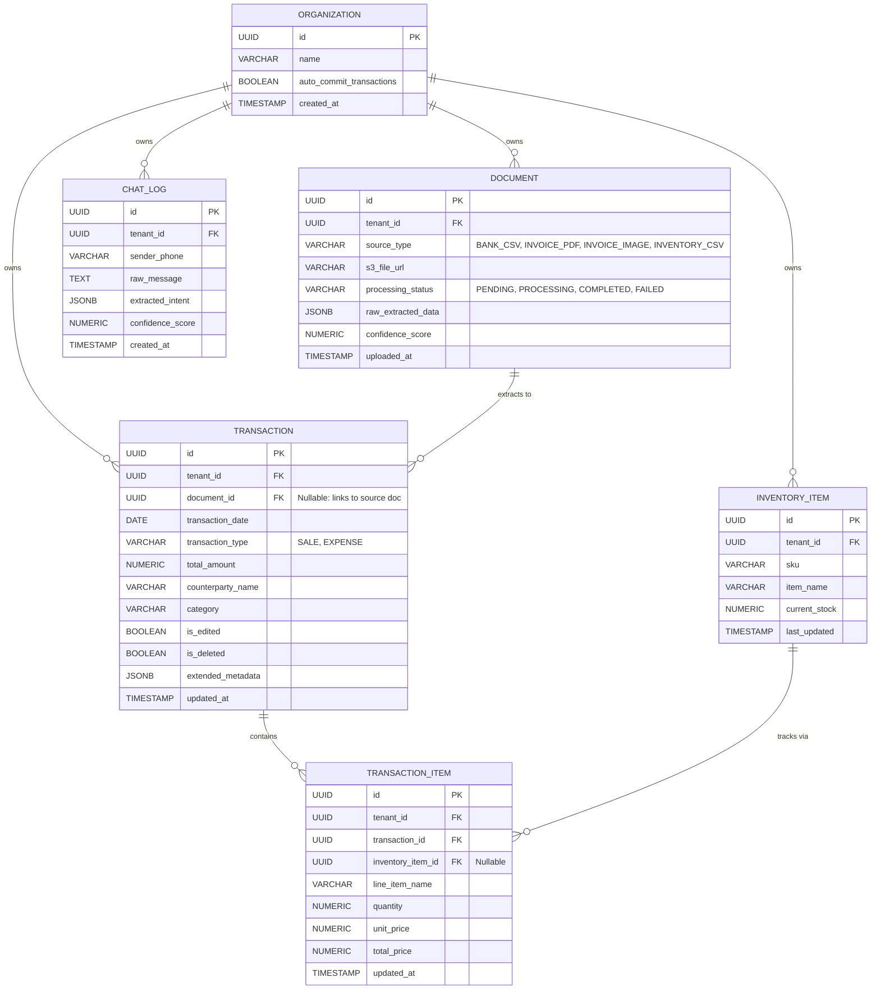

# Omni-CFO Platform: Technical Specification Document

This document contains the complete Entity Relationship Diagram, PostgreSQL Data Dictionary, and REST API Specification for the Omni-CFO multi-tenant architecture.

---

## 1. Entity Relationship Diagram (ERD)



---

## 2. Database Data Dictionary

### Table: `organizations`

Represents the business tenant container. Used for multi-tenant data partitioning.

| Column Name | Data Type | Nullable | Default | Description |
| --- | --- | --- | --- | --- |
| `id` | `UUID` | No | `gen_random_uuid()` | Primary Key. Unique identifier for the business. |
| `name` | `VARCHAR(255)` | No | None | Legal or operating name of the MSME. |
| `auto_commit_transactions` | `BOOLEAN` | Yes | `FALSE` | If `TRUE` and AI confidence is high, bypasses manual verification. |
| `currency` | `VARCHAR(10)` | Yes | `'INR'` | Currency code for aggregation and display. |
| `created_at` | `TIMESTAMPTZ` | Yes | `CURRENT_TIMESTAMP` | System timestamp of organization onboarding. |

### Table: `documents`

Tracks all physical/digital uploads through the ingestion and OCR lifecycle.

| Column Name | Data Type | Nullable | Default | Description |
| --- | --- | --- | --- | --- |
| `id` | `UUID` | No | `gen_random_uuid()` | Primary Key. |
| `tenant_id` | `UUID` | No | None | FK to `organizations(id)`. Enforces RLS. |
| `file_name` | `VARCHAR(255)` | No | None | Original name of the uploaded file. |
| `source_type` | `VARCHAR(50)` | No | None | `BANK_CSV`, `INVOICE_PDF`, `INVOICE_IMAGE`, `INVENTORY_CSV`. |
| `s3_file_url` | `TEXT` | No | None | Permanent URI to object storage. |
| `processing_status` | `VARCHAR(50)` | Yes | `'PENDING'` | `PENDING`, `PROCESSING`, `COMPLETED`, `FAILED`, `PENDING_REVIEW`. |
| `raw_extracted_data` | `JSONB` | Yes | `NULL` | Full JSON payload returned by OCR/LLM. |
| `confidence_score` | `NUMERIC(5,2)` | Yes | `NULL` | Model confidence metric (0.00 - 100.00). |
| `uploaded_at` | `TIMESTAMPTZ` | Yes | `CURRENT_TIMESTAMP` | Ingestion timestamp. |

### Table: `transactions`

The primary mathematically strict financial ledger.

| Column Name | Data Type | Nullable | Default | Description |
| --- | --- | --- | --- | --- |
| `id` | `UUID` | No | `gen_random_uuid()` | Primary Key. |
| `tenant_id` | `UUID` | No | None | FK to `organizations(id)`. |
| `document_id` | `UUID` | Yes | `NULL` | FK to `documents(id)`. Link to source proof. |
| `transaction_date` | `DATE` | No | None | The official accounting date. |
| `transaction_type` | `VARCHAR(20)` | No | None | `SALE` or `EXPENSE`. |
| `category` | `VARCHAR(100)` | No | None | Functional classification (e.g., "Logistics"). |
| `counterparty_name` | `VARCHAR(255)` | Yes | `NULL` | Customer or Vendor name. |
| `subtotal` | `NUMERIC(15,2)` | No | `0.00` | Amount excluding tax. |
| `tax_amount` | `NUMERIC(15,2)` | No | `0.00` | Applicable taxes. |
| `total_amount` | `NUMERIC(15,2)` | No | None | Final settlement value. |
| `payment_status` | `VARCHAR(50)` | Yes | `'PAID'` | `PAID`, `PENDING`, `PARTIAL`. |
| `payment_mode` | `VARCHAR(50)` | Yes | `'CASH'` | `CASH`, `UPI`, `BANK_TRANSFER`, `CREDIT`. |
| `is_verified` | `BOOLEAN` | Yes | `TRUE` | Data was reviewed by a human. |
| `is_edited` | `BOOLEAN` | Yes | `FALSE` | Field was modified post-ingestion. |
| `is_deleted` | `BOOLEAN` | Yes | `FALSE` | Soft-delete flag. |

### Table: `transaction_items`

Stores optional line-item breakdowns.

| Column Name | Data Type | Nullable | Default | Description |
| --- | --- | --- | --- | --- |
| `id` | `UUID` | No | `gen_random_uuid()` | Primary Key. |
| `tenant_id` | `UUID` | No | None | FK to `organizations(id)`. |
| `transaction_id` | `UUID` | No | None | FK to `transactions(id)`. |
| `line_item_name` | `VARCHAR(255)` | No | None | Product/service title. |
| `quantity` | `NUMERIC(12,3)` | Yes | `1.000` | Units purchased or sold. |
| `unit_price` | `NUMERIC(15,2)` | No | None | Cost per unit. |
| `total_price` | `NUMERIC(15,2)` | No | None | quantity * unit_price. |

### Table: `chat_logs`

Stores conversational message history and NLP processing state.

| Column Name | Data Type | Nullable | Default | Description |
| --- | --- | --- | --- | --- |
| `id` | `UUID` | No | `gen_random_uuid()` | Primary Key. |
| `tenant_id` | `UUID` | No | None | FK to `organizations(id)`. |
| `sender_phone` | `VARCHAR(20)` | Yes | `NULL` | Originating phone number. |
| `raw_message` | `TEXT` | No | None | Unmodified input text from the user. |
| `extracted_intent` | `JSONB` | Yes | `NULL` | Extracted JSON parameters. |
| `processing_status` | `VARCHAR(50)` | Yes | `'PENDING'` | Status of background processing. |

---

## 3. REST API Specification

**Global Authentication:**
All endpoints require the header: `Authorization: Bearer <JWT_TOKEN>`

### 3.1 Ingestion Module

#### `POST /api/v1/ingest/file`

Uploads raw file artifacts to object storage and enqueues parsing jobs.

* **Content-Type:** `multipart/form-data`
* **Payload:**
* `file` (Binary): The file payload.
* `source_type` (String): `BANK_CSV`, `INVOICE_PDF`, `INVOICE_IMAGE`, `INVENTORY_CSV`.


* **Response (202 Accepted):**

```json
{
  "document_id": "c8a9f2e3-4b5c-6d7e-8f9a-0b1c2d3e4f5a",
  "status": "PENDING",
  "message": "File uploaded and parsing job enqueued."
}

```

#### `POST /api/v1/ingest/text`

Accepts unstructured plain-text notes from messaging interfaces.

* **Content-Type:** `application/json`
* **Payload:**

```json
{
  "sender_phone": "+919876543210",
  "message": "Paid 4500 to Raju Transport for diesel"
}

```

* **Response (202 Accepted):**

```json
{
  "chat_id": "a1b2c3d4-e5f6-7a8b-9c0d-1e2f3a4b5c6d",
  "status": "PENDING"
}

```

#### `GET /api/v1/ingest/status/{document_id}`

Polls the extraction outcome of an uploaded file.

* **Response (200 OK):**

```json
{
  "document_id": "c8a9f2e3-4b5c-6d7e-8f9a-0b1c2d3e4f5a",
  "status": "COMPLETED",
  "confidence_score": 96.50,
  "extracted_data": {
    "transaction_date": "2026-08-30",
    "transaction_type": "EXPENSE",
    "category": "Logistics",
    "counterparty_name": "Raju Transport",
    "total_amount": 4500.00
  }
}

```

### 3.2 Transaction Management Module

#### `GET /api/v1/transactions`

Retrieves a paginated list of active transactions.

* **Query Parameters:** `page`, `limit`, `start_date`, `end_date`, `type`, `category`
* **Response (200 OK):**

```json
{
  "total_records": 128,
  "page": 1,
  "limit": 20,
  "transactions": [
    {
      "id": "a94c1d2e-5678-4321-bcde-f0123456789a",
      "transaction_date": "2026-08-30",
      "transaction_type": "EXPENSE",
      "category": "Logistics",
      "counterparty_name": "Raju Transport",
      "total_amount": 4500.00,
      "is_edited": false
    }
  ]
}

```

#### `PUT /api/v1/transactions/{transaction_id}`

Updates a transaction to correct misread fields.

* **Payload:**

```json
{
  "transaction_date": "2026-08-30",
  "transaction_type": "EXPENSE",
  "category": "Transport & Fuel",
  "counterparty_name": "Raju Transport Services",
  "total_amount": 4000.00,
  "notes": "Corrected misread amount."
}

```

* **Response (200 OK):**

```json
{
  "status": "SUCCESS",
  "message": "Transaction updated successfully."
}

```

#### `DELETE /api/v1/transactions/{transaction_id}`

Soft-deletes a record from the ledger.

* **Response (200 OK):**

```json
{
  "status": "SUCCESS",
  "message": "Transaction marked as deleted."
}

```

### 3.3 Intelligence Module

#### `GET /api/v1/analytics/kpis`

Fetches precomputed financial health metrics.

* **Query Parameters:** `start_date`, `end_date`
* **Response (200 OK):**

```json
{
  "total_revenue": 450000.00,
  "total_expenses": 310000.00,
  "net_profit": 140000.00
}

```

#### `POST /api/v1/chat/query`

Conversational Text-to-SQL interface.

* **Payload:**

```json
{
  "question": "What was my highest expense category this month?"
}

```

* **Response (200 OK):**

```json
{
  "question": "What was my highest expense category this month?",
  "generated_sql": "SELECT category, SUM(total_amount) FROM transactions WHERE is_deleted = false AND transaction_date >= '2026-08-01' GROUP BY category ORDER BY SUM(total_amount) DESC LIMIT 1;",
  "answer": "Your highest expense this month was **Logistics**, totaling **₹45,000**.",
  "data_preview": [
    {
      "category": "Logistics",
      "total_spent": 45000.00
    }
  ]
}

```