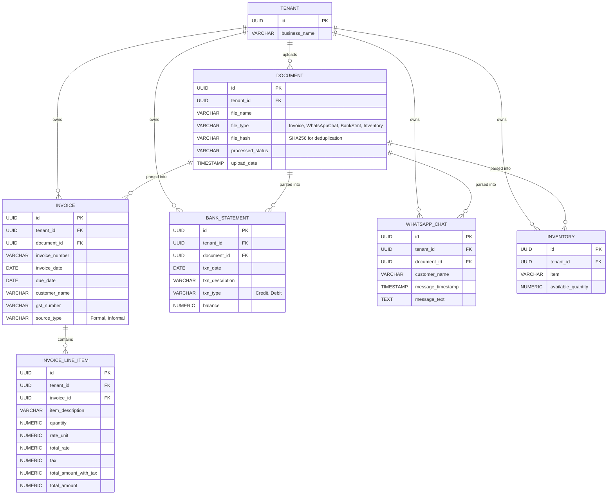

The rendering issue occurred because the previous response wrapped the entire document in a master code block, which prevents markdown viewers from processing the inner Mermaid block.

Copy and paste the text below exactly as it appears (do not put it inside another code block) into your `.md` file.

---

# AI Business Advisor: System Design Specification

This document contains the Entity Relationship Diagram (ERD), PostgreSQL Database Schema, and REST API Specification strictly aligned with the provided business workflows and data elements.

## 1. Entity Relationship Diagram (ERD)

The ERD is normalized to explicitly reflect the exact data structures defined in the requirements: Formal/Informal Invoices, Bank Statements, WhatsApp Chats, and Inventory.



## 2. PostgreSQL Database Schema

This schema enforces multi-tenancy via Row-Level Security (RLS) and implements the exact SHA-256 deduplication constraint required by the workflows.

```sql
-- 1. Tenant Table
CREATE TABLE tenants (
    id UUID PRIMARY KEY DEFAULT gen_random_uuid(),
    business_name VARCHAR(255) NOT NULL,
    created_at TIMESTAMP WITH TIME ZONE DEFAULT CURRENT_TIMESTAMP
);

-- 2. Document Tracking (Handles SHA-256 Deduplication)
CREATE TABLE documents (
    id UUID PRIMARY KEY DEFAULT gen_random_uuid(),
    tenant_id UUID NOT NULL REFERENCES tenants(id) ON DELETE CASCADE,
    file_name VARCHAR(255) NOT NULL,
    file_type VARCHAR(50) NOT NULL CHECK (file_type IN ('Invoice', 'WhatsAppChat', 'BankStmt', 'Inventory')),
    file_hash VARCHAR(64) NOT NULL, -- SHA256 Hash
    processed_status VARCHAR(50) DEFAULT 'PENDING',
    upload_date TIMESTAMP WITH TIME ZONE DEFAULT CURRENT_TIMESTAMP,
    CONSTRAINT unique_tenant_file_hash UNIQUE (tenant_id, file_hash)
);

-- 3. Invoices (Formal & Informal Combined)
CREATE TABLE invoices (
    id UUID PRIMARY KEY DEFAULT gen_random_uuid(),
    tenant_id UUID NOT NULL REFERENCES tenants(id) ON DELETE CASCADE,
    document_id UUID REFERENCES documents(id) ON DELETE SET NULL,
    invoice_number VARCHAR(100),
    invoice_date DATE,
    due_date DATE,
    customer_name VARCHAR(255),
    gst_number VARCHAR(50),
    source_type VARCHAR(50) CHECK (source_type IN ('Formal', 'Informal'))
);

-- 4. Invoice Line Items
CREATE TABLE invoice_line_items (
    id UUID PRIMARY KEY DEFAULT gen_random_uuid(),
    tenant_id UUID NOT NULL REFERENCES tenants(id) ON DELETE CASCADE,
    invoice_id UUID NOT NULL REFERENCES invoices(id) ON DELETE CASCADE,
    item_description VARCHAR(255),
    quantity NUMERIC(12, 3),
    rate_unit NUMERIC(15, 2),
    total_rate NUMERIC(15, 2),
    tax NUMERIC(15, 2),
    total_amount_with_tax NUMERIC(15, 2),
    total_amount NUMERIC(15, 2)
);

-- 5. WhatsApp Chats
CREATE TABLE whatsapp_chats (
    id UUID PRIMARY KEY DEFAULT gen_random_uuid(),
    tenant_id UUID NOT NULL REFERENCES tenants(id) ON DELETE CASCADE,
    document_id UUID REFERENCES documents(id) ON DELETE SET NULL,
    customer_name VARCHAR(255) NOT NULL, -- Extracted from ZIP file name
    message_timestamp TIMESTAMP WITH TIME ZONE,
    message_text TEXT NOT NULL
);

-- 6. Bank Statements
CREATE TABLE bank_statements (
    id UUID PRIMARY KEY DEFAULT gen_random_uuid(),
    tenant_id UUID NOT NULL REFERENCES tenants(id) ON DELETE CASCADE,
    document_id UUID REFERENCES documents(id) ON DELETE SET NULL,
    txn_date DATE,
    txn_description TEXT,
    txn_type VARCHAR(10) CHECK (txn_type IN ('Credit', 'Debit')),
    balance NUMERIC(15, 2)
);

-- 7. Inventory
CREATE TABLE inventory (
    id UUID PRIMARY KEY DEFAULT gen_random_uuid(),
    tenant_id UUID NOT NULL REFERENCES tenants(id) ON DELETE CASCADE,
    document_id UUID REFERENCES documents(id) ON DELETE SET NULL,
    item VARCHAR(255) NOT NULL,
    available_quantity NUMERIC(12, 3) NOT NULL,
    UNIQUE(tenant_id, item)
);

-- Apply Row-Level Security (RLS) for Multi-Tenancy
ALTER TABLE documents ENABLE ROW LEVEL SECURITY;
ALTER TABLE invoices ENABLE ROW LEVEL SECURITY;
ALTER TABLE invoice_line_items ENABLE ROW LEVEL SECURITY;
ALTER TABLE whatsapp_chats ENABLE ROW LEVEL SECURITY;
ALTER TABLE bank_statements ENABLE ROW LEVEL SECURITY;
ALTER TABLE inventory ENABLE ROW LEVEL SECURITY;

CREATE POLICY isolate_documents ON documents USING (tenant_id = current_setting('app.current_tenant')::UUID);
-- (Apply identical policies to all other tables)

```

## 3. REST API Specification

These APIs directly fulfill the UI/API requirements outlined in the workflow document. All requests require `Authorization: Bearer <JWT>` containing the `tenant_id`.

### 1. Upload File

Computes the SHA256 hash of the file contents. If the hash exists for the tenant, it prevents duplicate insertion.

* **Endpoint:** `POST /api/v1/files/upload`
* **Content-Type:** `multipart/form-data`
* **Request Parameters:**
* `file` (Binary): The uploaded PDF, ZIP, or CSV file.
* `fileType` (String): Must be `Invoice`, `WhatsAppChat`, `BankStmt`, or `Inventory`.


* **Success Response (201 Created):**

```json
{
  "document_id": "c8a9f2e3-4b5c-6d7e-8f9a-0b1c2d3e4f5a",
  "fileType": "Invoice",
  "status": "PENDING",
  "message": "Upload successful. File queued for processing."
}

```

* **Conflict Response (409 Conflict) - Duplicate File:**

```json
{
  "error": "DUPLICATE_FILE",
  "message": "A file with this SHA256 hash has already been uploaded."
}

```

### 2. List Uploaded Files

Provides the data required for the UI to show a list of uploaded files, their dates, and processed statuses.

* **Endpoint:** `GET /api/v1/files`
* **Query Parameters:**
* `fileType` (Optional): Filter by `Invoice`, `WhatsAppChat`, `BankStmt`, or `Inventory`.


* **Success Response (200 OK):**

```json
{
  "files": [
    {
      "document_id": "c8a9f2e3-4b5c-6d7e-8f9a-0b1c2d3e4f5a",
      "file_name": "march_invoices.pdf",
      "fileType": "Invoice",
      "upload_date": "2026-08-30T10:15:30Z",
      "processed_status": "COMPLETED"
    },
    {
      "document_id": "f5a7d9e1-2b4c-8d3e-1f5a-6b8c9d0e2f4a",
      "file_name": "Ramesh_Traders_Chat.zip",
      "fileType": "WhatsAppChat",
      "upload_date": "2026-08-30T11:05:12Z",
      "processed_status": "PENDING"
    }
  ]
}

```